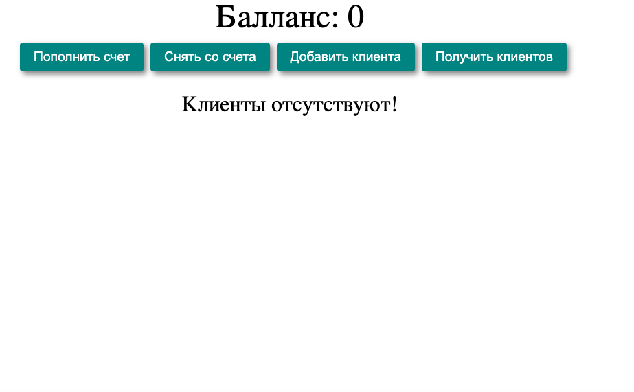
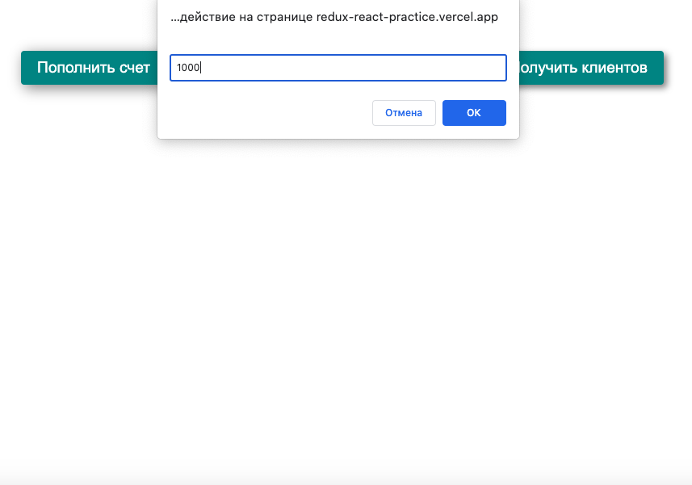
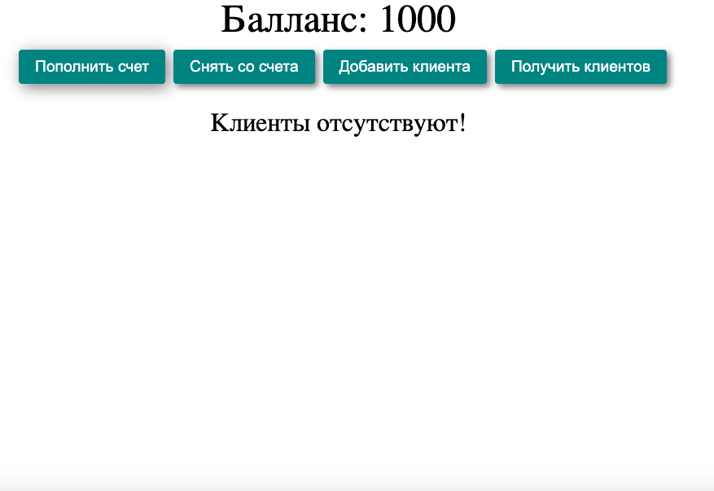
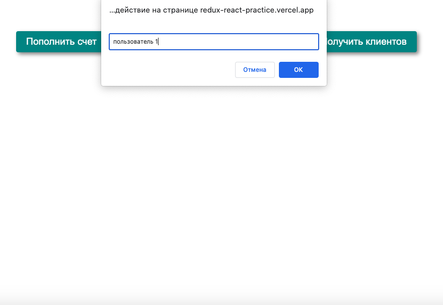
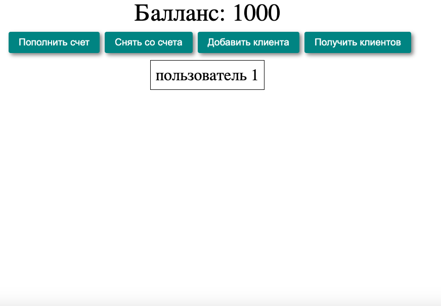

# Redux/React практика

Проект доступен по ссылке - https://redux-react-practice.vercel.app/

## Стек   

- React  
- Redux  

В проекте представлены базовые возможности Redux - синхронное (изменение счетчика) и асинхронное (получение списка пользователей от сервера) изменение состояния. Рассмотрела работа с состоянием в виде массива. 

Разобраны концепции Redux:  

- store, dispatch, action, reducer, combineReducers, Provider
- работа с асинхронным кодом с помощью middleware и объекта thunk, которые позволяют создавать асинхронные экшен-криэйторы.  
- composeWithDevtools

Разобраны особенности использования Redux в React:  

- хук useDispatch  
- хук useSelector

Считается хорошей практикой выносить состояние из самого компонента. Во первых потому что компонентам со своими локальными состояниями сложно взаимодействовать друг с другом. Во вторых состояние в компоненте может затруднять доработку, изменение приложения, например если верстка влияет на изменение состояния.

Redux выполняет роль контейнера для состояния. Позволяет вынести состояние приложения из компонента в отдельный слой (store), изменяет состояние с помощью системы редюсеров и экшенов. Компонент отслеживает изменение состояния в store (получает уведомление из store) и обновляется при изменении состояния.

Функционал приложения: в приложении созданы два состояния - Счетчик и Пользователи. При клике на кнопки Пополнить счет, Снять со счета, Добавить клиента вызывается функция prompt, состояние меняется синхронно с учетом введенных значений. При клике на кнопку Получить клиентов состояние меняется асинхронно - отправляется запрос и сервер возвращает массив пользователей, которые отрисовываются в приложении. При клике на карточку клиента, он удаляется. 

    

  

  

  

  

  

